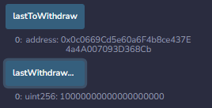

# Module_20_homework

Using the setAccounts function to define the authorized Ethereum address that will be able to withdraw funds from the contract.

Viewing initial balance of the contract.

Testing the deposit functionality of your smart contract by sending 1 ether as wei.

Testing the deposit functionality of your smart contract by sending 10 ether as wei.

Testing the deposit functionality of your smart contract by sending 5 ether.

Withdrawing 5 ether into accountOne.

Withdrawing 10 ether into accountTwo.

Using the lastToWithdraw and lastWithdrawAmount functions to verify that the address and amount were correct.

